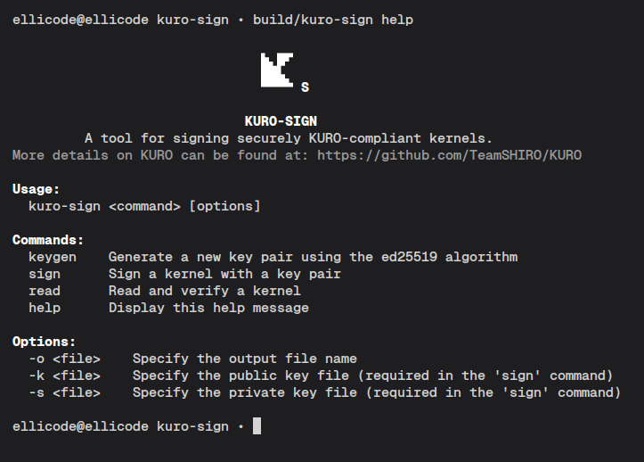

# kuro-sign

**kuro-sign** is a minimal command-line tool for signing and verifying KURO-compliant UEFI kernels using the Ed25519 digital signature algorithm. More info on the KURO footer and signing in the [Official KURO Convention](https://github.com/TeamSHIRO/KURO/blob/main/docs/kuro_booting_convention.md)

## Features

- Generate Ed25519 key pairs
- Sign kernel images
- Verify and read signed kernel images
- Simple CLI interface
- Secure cryptographic operations (Ed25519, OpenSSL)

## Usage

```
kuro-sign {command} {kernel-path} [options]
```

### Available commands

- `keygen`: **Generate a new key pair using the ed25519 algorithm**. The key pair will be saved in two different files ("kuro.pub" and "kuro.priv" by default). The prefix can be modified with the `-o` attribute.

- `sign`: **Sign a kernel image using a specified key pair**. The kernel image will be signed with the provided public and private keys. The output path can be specified with the `-o` attribute.

- `read`: **Read and verify a signed kernel image**. This command allows you to inspect the signature and other metadata of a signed kernel image.

### Attributes

- `-o <file>`: Specify the output file path. This attribute can be used with the `keygen` and `sign` commands to define the location of the generated key pair or signed kernel image.

- `-k <public-key-path>`: Specify the path to the public key file. This attribute is used with the `sign` and `read` commands to provide the public key for signing or verification.

- `-s <private-key-path>`: Specify the path to the private key file. This attribute is used with the `sign` command to provide the private key for signing.

## Quickstart

First, prepare your environment by generating a new key pair:

```bash
kuro-sign keygen -o my_kernel
```

New files named `my_kernel.pub` and `my_kernel.priv` will be created, containing the public and private keys, respectively.

Next, sign your kernel image using the generated key pair:

```bash
kuro-sign sign -k my_kernel.pub -s my_kernel.priv  my_kernel.bin
```

Your kernel will now contain a valid KURO footer containing an Ed25519 signature. You can verify its integrity with

```bash
kuro-sign read my_kernel.bin
```

That's it! Your kernel will now be securely booted by the KURO bootloader. More details on [KURO's repository](https://github.com/TeamSHIRO/KURO).

## Contributing

Please read the [**CONTRIBUTING**](CONTRIBUTING.md) guide for details on how to contribute to this project.

## License

<a href="https://www.apache.org/">
    
</a>

**kuro-sign** is licensed under **Apache License 2.0**.

The full text of the license can be obtained at
http://www.apache.org/licenses/LICENSE-2.0
or in the [**LICENSE**](LICENSE) file included in this repository.

**NOTICE** file included in this repository can be found [**here**](NOTICE).
